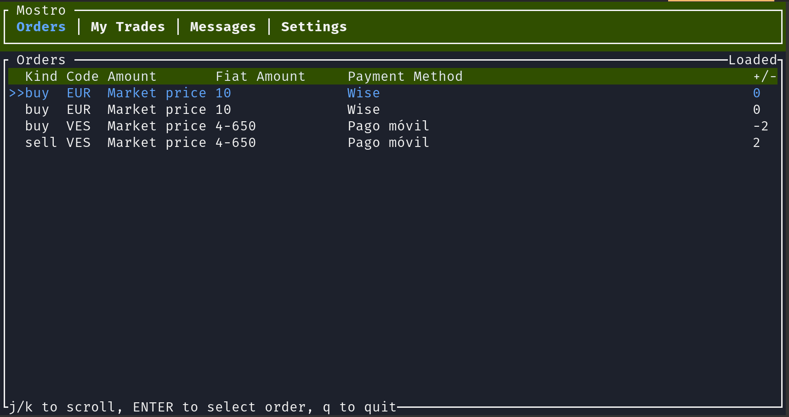

# Mostrui 🧌


**This is work in progres**

Terminal client for p2p using Mostro protocol.



## Requirements:

0. You need Rust version 1.64 or higher to compile.

## Install dependencies:

To compile on Ubuntu/Pop!\_OS, please install [cargo](https://www.rust-lang.org/tools/install), then run the following commands:

```bash
$ sudo apt update
$ sudo apt install -y cmake build-essential pkg-config
```

## Install

```bash
$ git clone https://github.com/MostroP2P/mostrui.git
$ cd mostrui
```

### Settings

Make sure that you have the following settings in your `~/.mostrui/settings.toml` file, you can find an example of the settings file in `settings.tpl.toml`, so you can copy it and modify it to your needs.

```toml
mostro_pubkey = "0000000000000000000000000000000000000000000000000000000000000000"
relays = ["wss://relay.mostro.network", "wss://nostr.bilthon.dev"]
```

### Run

```bash
$ cargo run
```
